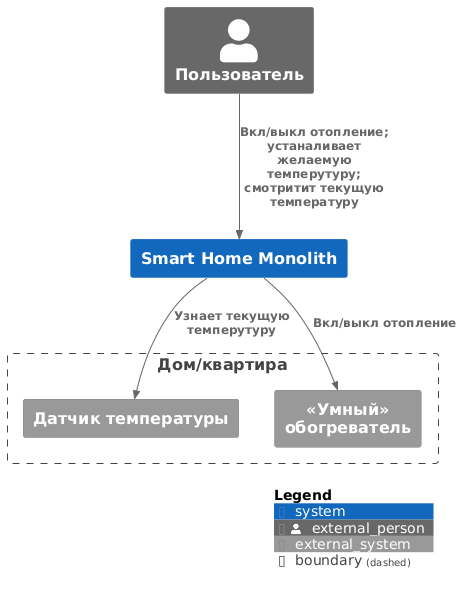
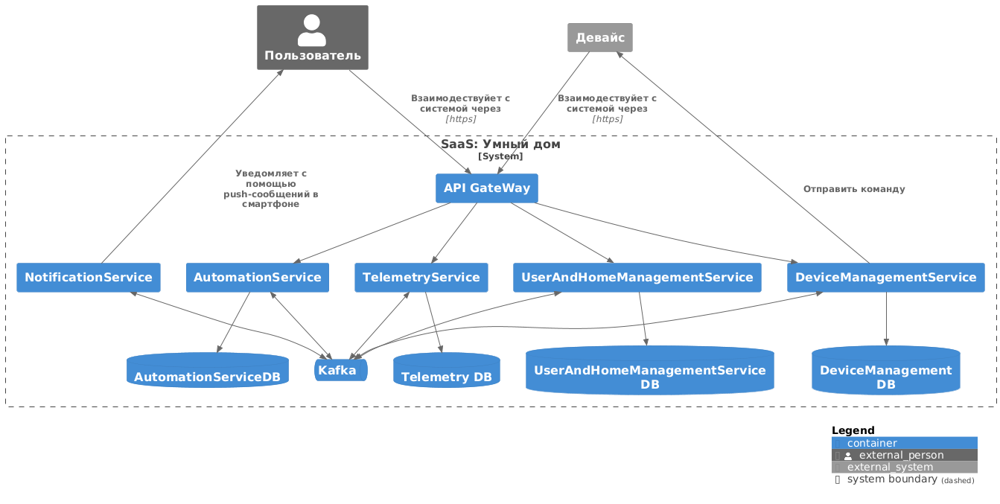
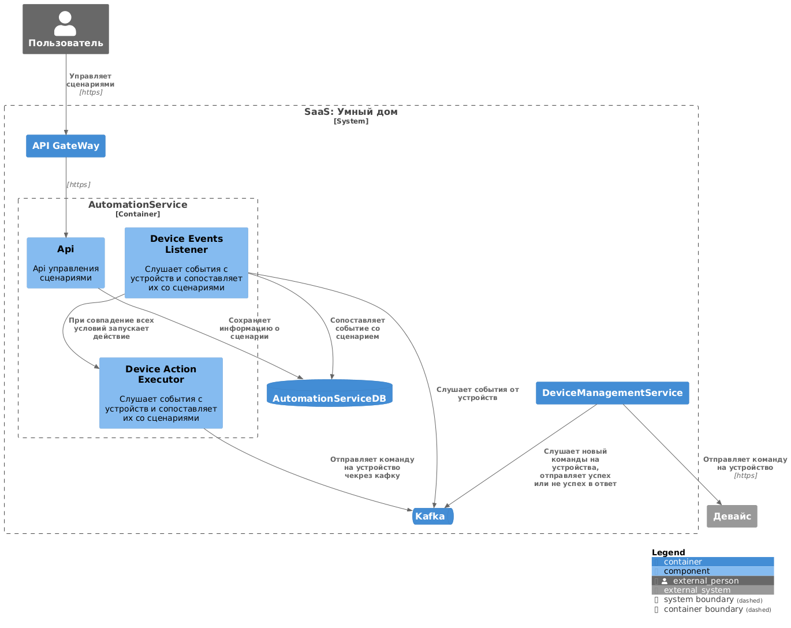
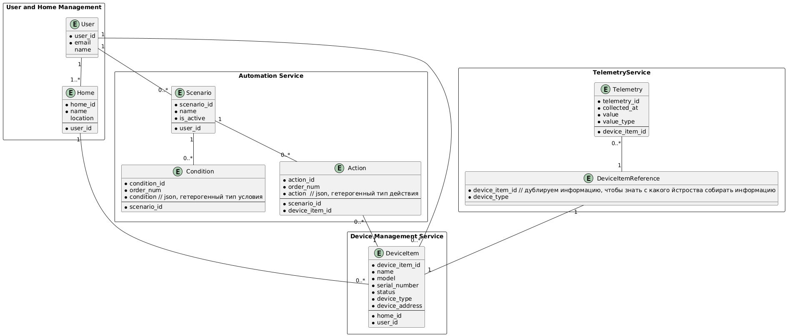

# Smart Home Monolith

# 1. Анализ и проектирование

## 1.1. Анализ и планирование

### 1.1.1. Описание текущего решения

Проект "Smart Home Monolith" представляет собой монолитное приложение для управления отоплением и мониторинга температуры в умном доме. Пользователи могут удаленно включать/выключать отопление, устанавливать желаемую температуру и просматривать текущую температуру через веб-интерфейс.

**Управление отоплением:**
- Пользователи могут удалённо включать/выключать отопление в своих домах.
- Пользователи могут устанавливать желаемую температуру.
- Система автоматически поддерживает заданную температуру, регулируя подачу тепла.

**Мониторинг температуры:**
- Система получает данные о температуре с датчиков, установленных в домах.
- Пользователи могут просматривать текущую температуру в своих домах через веб-интерфейс.

На текущий момент в монолите реализовано только упраление желаемым состоянием, например, можно записать в БД желаемую температуру и вкл/выкл обогревателя. Взаимодействите с датчиками и обогревателями еще не реализовано.

### 1.1.2. Текущая архитектура

- **Язык программирования:** Java
- **База данных:** PostgreSQL
- **Архитектура:** Монолитная, все компоненты системы (обработка запросов, бизнес-логика, работа с данными) находятся в рамках одного приложения.
- **Взаимодействие:** Синхронное, запросы обрабатываются последовательно.
- **Масштабируемость:** Ограничена, так как монолит сложно масштабировать по частям.
- **Развертывание:** Требует остановки всего приложения.

### 1.1.3. Домены и границы контекста будущего решения

1. Управление пользователями  
Регистрация новых пользователей, удаление
1. Управление устройствами  
Регистрация устройства в системе (привязка к дому и пользователю), информация о расположении устройства, удаление устройства, отправление сигналов вкл/выкл на устройство, возможность узнать текущее состояние устройства (вкл/выкл), программирование сценариев
1. Управление  сценариями  
Пользователь настраивает сценарии и они автоматически выполняются
1. Управление телеметрией  
Принимает сигналы от устройств или поллит их состояние.
1. Нотификации  
Отправка уведомлений пользователям. Например, уведомление о том, что температура достигла указанного значения.

Система позволяет управлять отоплением, включать и выключать свет, запирать и отпирать автоматические ворота, удаленно наблюдать за домом и будущее неуточненное поведение.

### 1.1.4. Визуализация текущего решения

см. код тут: [./docs/current_system_context.puml](./docs/current_system_context.puml)



## 1.2. Архитектура микросервисов

### 1.2.1. Декомпозиция на микросервисы

1. Сервис управление пользователями
1. Сервис нотификаций
1. Сервис сценариев
1. Сервис управления устройствами
1. Сервис сбора и обработки телеметрии

### 1.2.2. Определение взаимодействий

- микросервисы - асинхронное если между собой (kafka), синхронное API для гейтвея
- API Gateway - синхронное
- шина данных (Kafka) - асинхронное
- база данных - синхронное

### 1.2.3. Визуализация архитектуры

#### 1.2.3.1. Уровень контейнеров

см. код тут: [./docs/new_system_containers.puml](./docs/new_system_containers.puml)



#### 1.2.3.2. Уровень компонентов

см. код тут: [./docs/new_system_components.puml](./docs/new_system_components.puml)



## 1.3. ER-диаграмма

### 1.3.1. Идентификация сущностей

- Пользователь
- Дом
- Экземляр устройства
- Данные телеметрии
- Сценарий
- Условие
- Действие

### 1.3.2. Идентификация сущностей
см. ниже

### 1.3.3. Описание связей
см. ниже

### 1.3.4. Построение ER-диаграммы

см. код тут: [./docs/ER.puml](./docs/ER.puml)



## 1.4 Создание и документирование API

### 1.4.1. Идентификация сущностей

Для взаимодествия между сервисами выбран AsyncAPI

### 1.4.2. Проектирование API для микросервиса «Управление устройствами»

Можно посмотреть как в ямле, так и уже в html формате:
- [./docs/devicemanagement/asyncapi.yaml](./docs/devicemanagement/asyncapi.yaml)
- [./docs/devicemanagement/index.html](./docs/devicemanagement/index.html)

### 1.4.3. Проектирование API для микросервиса «Телеметрия»

Можно посмотреть как в ямле, так и уже в html формате:
- [./docs/telemetryservice/asyncapi.yaml](./docs/telemetryservice/asyncapi.yaml)
- [./docs/telemetryservice/index.html](./docs/telemetryservice/index.html)

# 2. Разработка MVP

Выполните команды

```
docker compose up -d
```

```
./init.sh
```

По итогу, будет доступно 2 сервиса:
- [http://localhost:10000/swagger](http://localhost:10000/swagger) - DeviceManagement
- [http://localhost:11000/swagger](http://localhost:11000/swagger) - TelemetryService

Можно првоерить такой сценарий:
1. открыть http://localhost:10000/swagger
2. вызвать POST и скопировать получившийся гуид
3. открыть http://localhost:11000/swagger
4. вызвать PUT с гуидом из прошлого (до тех пор пока не будет 422, ему нужно время на чтение сообщения из кафки)

Так же в сервисе телеметрии можно будет получить от 1-100 последних записей по device id

В сервисе устройств можно будет так же посмотреть информацию по deviceId и удалить устройство (синканется в телеметрию и там спустя время тоже все удалится!)

Из опциональных заданий: был развернут кафка кластер и один из топик имеет 3 партиции и 2 реплики